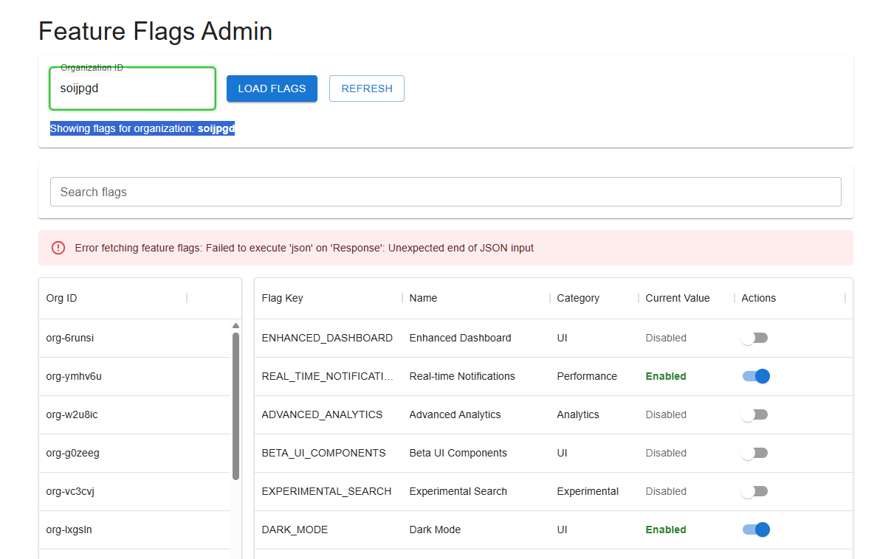
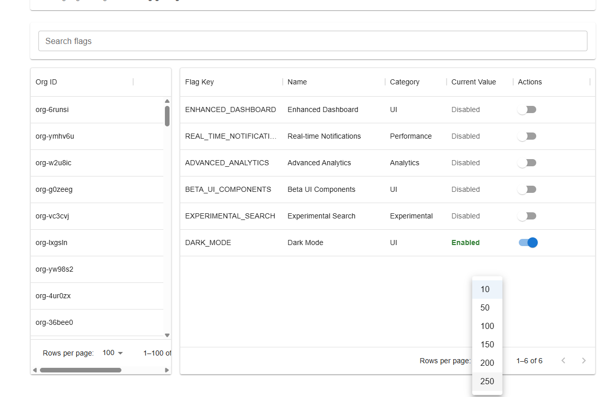
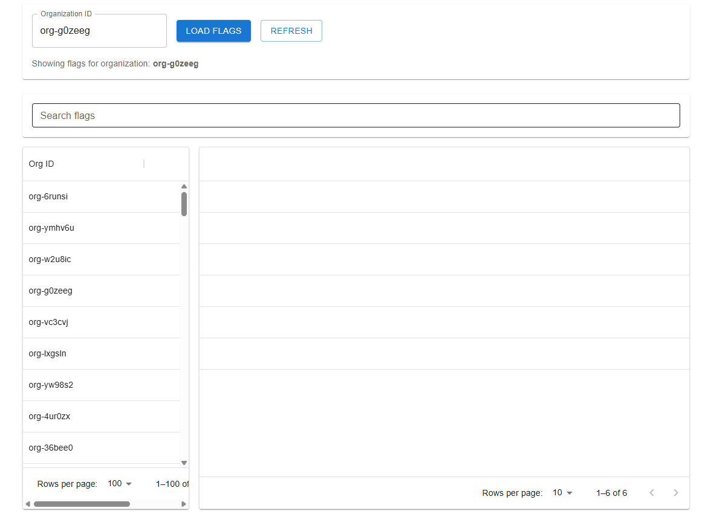
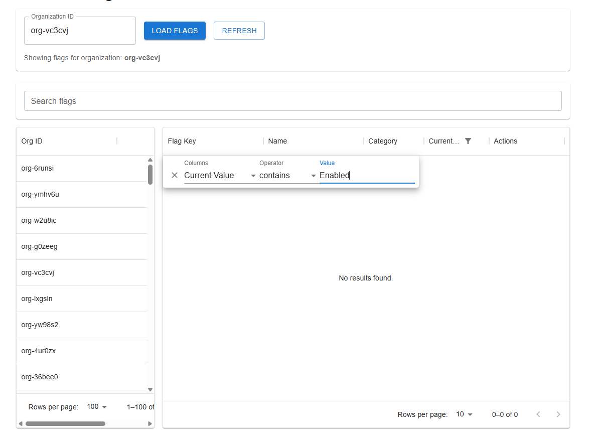

# Feature Flags Admin Tool – Bug Report
**Date:** July 11, 2025  
**Author:** Mia Armstrong  
**Application Version:** QA Engineering Evaluation Project  
**Environment:** Local (localhost:5173 / mock-api on localhost:4000)

---

## Summary

This document captures bugs identified during exploratory testing of the Feature Flags Admin Tool. Each bug includes a title, description, steps to reproduce, actual vs. expected behavior, severity, and suggested fix.

---

## 1. Error Message When Searching for Invalid Organization

**Description:**  
When searching for an organization that doesn’t exist, the UI returns an unexpected JSON error.

**Steps to Reproduce:**
1. Open the Organization sidebar.
2. Type in a search term that doesn’t match any organization.
3. Observe the UI error message and behavior.

**Actual Behavior:**
- Error message: `Error fetching feature flags: Failed to execute 'json' on 'Response': Unexpected end of JSON input`
- The flag table for the *first* organization in the list (e.g., `soijpgd`) gets loaded instead of remaining empty. 

**Expected Behavior:**
- Message should indicate “no results” without throwing an error.
- No feature flag data should load for any unrelated org.

**Severity:** Major  
**Suggested Fix:** Improve error handling in the fetch logic and ensure fallback behavior does not default to unrelated org.

---

## 2. Documentation Bug: Missing Non-Boolean Flag Types

**Description:**  
The README claims support for boolean, number, and string flag types, but only boolean values are currently implemented in the flag definitions.

**Expected vs. Actual:**
- **README says:** _“Flag types include: boolean, number, and string values”_
- **Actual implementation:** All flags in `/types/featureFlags.ts` are defined with `valueType: "boolean"` only.

**Additional Context:**  
The mock API contains logic (`getRandomValueForFlag`) that would return number and string values **if** such flags existed. However, no flags with `valueType: "number"` or `"string"` are present in the application, so this code path is currently untestable.

**Severity:** Minor  
**Suggested Fix:**  
- Update the README to reflect the current boolean-only implementation  
**OR**  
- Add at least one non-boolean flag (`string` or `number`) to `FeatureFlagDefinitions.ts` to validate the full range of supported data types.

---

## 3. Row Count Limit Inconsistent Across Tables

**Description:**  
“Rows per page” behaves inconsistently and can crash the app.

**Steps to Reproduce:**
1. In the Org ID sidebar, try setting Rows per Page to a value > 100.
2. Observe the UI crash and white screen.

**Actual Behavior:**
- Org ID table supports max of 100 rows.
- Flag Key table supports 250 rows.
- Setting above 100 crashes the page. 

**Severity:** Major  
**Suggested Fix:**  
- Harmonize limits or validate input.
- Prevent white screen crash with error boundary.

---

## 4. Can’t Restore Hidden Columns After “Hide All”

**Description:**  
Using the “Hide All” button in the Show Columns dialog leaves user with no visible columns and no recovery path.

**Steps to Reproduce:**
1. Open kebab menu for Key/Flag table.
2. Select “Show Columns”
3. Click “Hide All”
4. Exit the dialog

**Actual Behavior:**  
- All columns disappear
- There’s no way to restore them unless user refreshes or switches orgs. 

**Expected Behavior:**  
- Either “Hide All” should be reversible via UI or “Show Columns” should stay accessible.

**Severity:** Major  
**Suggested Fix:**  
- Add fail-safe (e.g., always-visible reset columns button)

---

## 5. Current Value Column Filter Does Not Work

**Description:**  
Filtering by “Contains” or “Equals” for `Current Value` column yields no results—even when valid.

**Steps to Reproduce:**
1. Try filtering for “Contains Disabled” or “Equals Enabled”
2. Observe that no rows are returned, even though such values exist.

**Actual Behavior:**  
- No rows shown.

**Expected Behavior:**  
- Matching rows with “Enabled” or “Disabled” should appear.

**Severity:** Major  
**Suggested Fix:**  
- Inspect filter predicate logic or column data parsing.

---

## 6. Actions Filter Has No Discernible Effect

**Description:**  
The filter options under the “Actions” column do not alter the table contents meaningfully.

**Filter Options Observed:**
- contains
- equals
- starts with
- ends with
- is empty
- is not empty
- is any of

**Expected Behavior:**  
- These filters should show/hide rows based on actionable values.

**Actual Behavior:**  
- Filters apply, but table stays unchanged.

**Severity:** Minor  
**Suggested Fix:**  
- Either fix filter logic or hide filter if the column is not meant to be searchable.

---

## 7. Toggle Failure Displays Error on Network Drop

**Description:**  
When toggling a feature flag and the network/API connection is interrupted, the UI displays an error message and visually reverts the change.

**Steps to Reproduce:**
1. Select any organization.
2. Toggle a feature flag.
3. Simulate a network failure (e.g., stop the mock API server).
4. Observe the behavior.

**Actual Behavior:**
- Error shown: `Error updating feature flag: Failed to fetch`
- Toggle visually reverts.

**Expected Behavior:**
- Graceful error message with user guidance (e.g., “Please check your network connection”)
- Possibly a toast or inline alert rather than a raw error.

**Severity:** Minor  
**Suggested Fix:**  
Improve error handling and UI feedback for failed PUT requests.

---